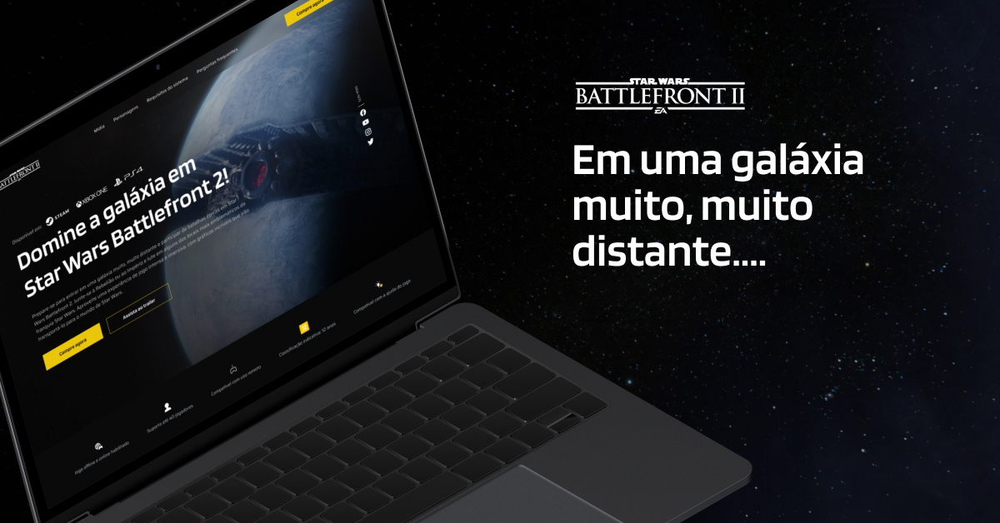

<h1 align="center"> Star Wars Battlefront 2 </h1>

Projeto desenvolvido durante o curso da Coderhouse

  <a href="#-tecnologias">Tecnologias</a>&nbsp;&nbsp;&nbsp;|&nbsp;&nbsp;&nbsp;
  <a href="#-projeto">Projeto</a>&nbsp;&nbsp;&nbsp;|&nbsp;&nbsp;&nbsp;
  <a href="#-layout">Layout</a>&nbsp;&nbsp;&nbsp;|&nbsp;&nbsp;&nbsp;
  <a href="#memo-licença">Licença</a>

  

 

  

## 🚀 Tecnologias

Esse projeto foi desenvolvido com as seguintes tecnologias:

- HTML
- CSS
- JavaScript

## 💻 Projeto

Esse projeto apresenta uma interface do jogo Star Wars Battlefront 2 da Eletronic Arts, redesenhando a página original e também consumindo uma API pública do Star Wars.

## 🔖 Layout

Você pode visualizar o a interface gráfica através [DESSE LINK](https://www.figma.com/proto/Hzkewq0szPitYANALvVa9e/Projeto-Star-Wars?page-id=0%3A1&node-id=4%3A2&viewport=477%2C889%2C0.55&scaling=scale-down-width&starting-point-node-id=4%3A2).

## :memo: Licença

Esse projeto está sob a licença MIT.

---

Feito por [Luiz Ricardo](https://github.com/luuizz) | [André Yabutti](https://github.com/andreyabuuti) |  [Hiago Santos](https://github.com/HiagoSant223) |  [Marcos Luz](https://github.com/Marcos-ky) | Igor Lima